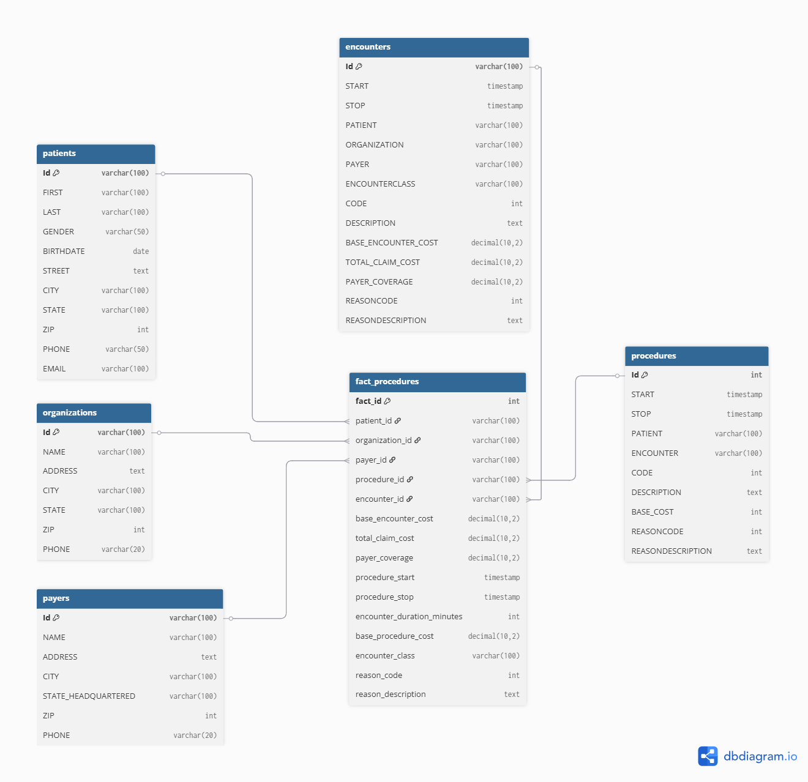
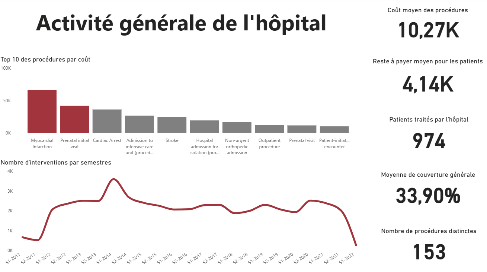

# Contexte du projet

Ce projet fictif vise à concevoir un entrepôt de données (Data Warehouse) destiné à l’analyse des coûts médicaux, de la charge d’activité hospitalière et du remboursement des soins.

Les données sources proviennent de plusieurs systèmes opérationnels hospitaliers (rencontres patients, procédures médicales, payeurs, etc.).
L’objectif est de permettre la création de tableaux de bord Power BI facilitant la prise de décision stratégique et financière.

# Objectifs principaux

- Centraliser et historiser les données hospitalières dans un modèle cohérent.
- Calculer et suivre les indicateurs clés de performance (KPI) liés :
  -  aux coûts des soins,
  -  à la charge médicale,
  -  aux taux de remboursement,
  -  à la saisonnalité de l’activité.
- Fournir une base fiable pour les analyses Power BI et les reportings automatisés.

# Architecture du Data Warehouse

## Modèle en étoile (Star Schema)

Le modèle repose sur une structure fact/dimension, facilitant les agrégations et les jointures rapides.

### La table de faits

| Table            | Description                                                                                                                             |
| ---------------- | --------------------------------------------------------------------------------------------------------------------------------------- |
| `fact_procedure` | Contient le détail des procédures médicales effectuées lors des rencontres, avec leur coût, durée et remboursement.                     |

### Les tables de dimension

| Table                 | Description                                                                  |
| --------------------- | ---------------------------------------------------------------------------- |
| `dim_patient`         | Informations démographiques et administratives des patients.                 |
| `dim_provider`        | Données sur les praticiens ou établissements de soins.                       |
| `dim_payer`           | Informations sur les assureurs ou financeurs.                                |
| `dim_date`            | Table de référence temporelle (jour, mois, trimestre, année).                |
| `dim_procedure_type`  | Typologie et classification des actes médicaux.                              |
| `dim_encounter_class` | Catégorisation des rencontres (ambulatoire, urgence, hospitalisation, etc.). |

# Liste des KPi

## Analyse des coûts

Ces KPI permettent de mesurer l’efficacité économique des soins. Ils mettent en évidence le niveau moyen des dépenses, la répartition des coûts entre patients et assureurs, ainsi que les procédures les plus coûteuses. L’objectif est d’optimiser les budgets hospitaliers et de mieux comprendre les leviers d’économie possibles.

| KPI                                    | Objectif Power BI                            |
| -------------------------------------- | -------------------------------------------- |
| **Coût moyen par rencontre**           | Mesurer les coûts moyens par hôpital         |
| **Coût moyen par procédure**           | Identifier les procédures les plus coûteuses |
| **Total des dépenses**                 | Coût global par mois / par payeur            |
| **Part du remboursement**              | Taux de couverture des assurances            |
| **Marge patient (reste à charge)**     | Identifier les dépenses à charge du patient  |
| **Durée moyenne des procédures (min)** | Évaluer la complexité opérationnelle         |

## Activité médicale

Ce groupe d’indicateurs suit la charge de travail médicale et la fréquence des interventions. Ils aident à évaluer la performance opérationnelle des services, la densité d’actes par patient et les types de procédures les plus réalisées. Ces données soutiennent la planification des ressources et l’analyse de la productivité.

| KPI                                            | Objectif                                 |
| ---------------------------------------------- | ---------------------------------------- |
| **Nombre total de procédures**                 | Volume d’activité médicale               |
| **Nombre de rencontres**                       | Fréquence des consultations              |
| **Procédures par patient**                     | Suivi de la charge médicale individuelle |
| **Top 10 procédures les plus fréquentes**      | Identifier les actes les plus courants   |
| **Durée moyenne par classe d’encounter**       | Analyse des flux hospitaliers            |
| **Taux de procédures multiples par rencontre** | Densité d’actes par visite               |

## Analyse temporelle

Ces indicateurs offrent une vision chronologique de l’activité et des coûts. Ils servent à détecter les tendances saisonnières, à suivre l’évolution des dépenses dans le temps et à anticiper les périodes de forte activité. Cette analyse soutient la planification stratégique et la gestion proactive des capacités hospitalières.

| KPI                                       | Objectif                          |
| ----------------------------------------- | --------------------------------- |
| **Nombre de procédures par mois**         | Évolution de la charge            |
| **Évolution du coût total dans le temps** | Détection d’anomalies financières |
| **Saisonnalité des encounters**           | Anticiper les pics d’activité     |

# Création du Power BI

Le rapport a été créé sous Power BI, il comporte deux pages principales : L'activité générale et l'activité médicale de l'hôpital
Le rapport ne fait pas spécialement sens due aux valeurs aléatoires générées

